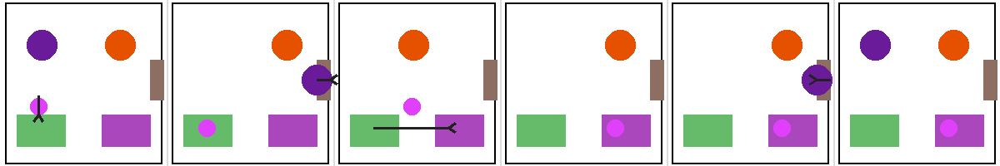
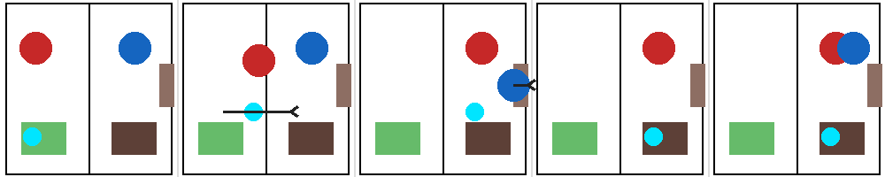

# Qualitative failure cases

Anonymous supplementary material for reviewer inspection. This repository presents two saved cases from the same evaluation model and probe family. The examples are intended to make the failure modes concrete; they are qualitative illustrations, not new aggregate estimates.

## Overview

| Example | Comparison | Outcome | Main point |
|---|---|---|---|
| 1. Visual-only failure | A versus Bp, Bf, and C | A is incorrect; all scaffolded and text conditions are correct | The transfer event is missed from pixels but recovered when the event is made explicit. |
| 2. Text-only failure | C with full ground-truth narration | Incorrect | Text-side inference can still fail when the model must retain what an agent witnessed. |

Condition labels: **A** = visual-only input; **Bp** = perceptual scaffold; **Bf** = full scaffold; **C** = text-only input.

## Example 1: visual-only failure recovered by scaffolds

The question asks where the object actually ends up, so it does not require belief attribution. The correct answer is **right**.

### Panel strip

  

### Scene sequence

| Panel | Relevant event |
|---|---|
| 1 | Purple and orange are present; purple places the pink object near the left mint container. |
| 2 | Purple exits; orange remains; the object is in the left mint container. |
| 3 | Only orange is present; the object moves toward the right violet container. |
| 4 | The object is in the right violet container. |
| 5 | Purple returns; the object remains in the right violet container. |
| 6 | Both characters are present; the object remains in the right violet container. |

### Result

The visual-only response is **left** and incorrect. The perceptual scaffold, full scaffold, and text-only condition all answer **right** and are correct.

### Verbatim prompts and outputs

Visual-only input (A)

**Prompt**

\`\`\`text
Study this 6-panel visual sequence. Where is the pink object actually located in the final panel, left or right? Answer ONLY 'left' or 'right'.
\`\`\`

**Model output:** \`left\`  
**Expected:** \`right\`  
**Result:** Incorrect

Perceptual scaffold (B_p)

**Prompt**

\`\`\`text
Study this image. Here is a structured perceptual description: Panel 1: purple and orange characters are in the room. pink object is near the left mint container. purple character places the object there. Panel 2: purple character moves to the door and exits. orange character remains in the room. pink object is in the left mint container. Panel 3: Only orange character is in the room. pink object moves from the left mint container toward the right violet container. Panel 4: orange character is in the room. pink object is in the right violet container. Panel 5: purple character returns through the door. orange character is in the room. pink object is in the right violet container. Panel 6: purple and orange characters are both in the room. pink object is in the right violet container. Where is the pink object actually located in the final panel, left or right? Answer ONLY 'left' or 'right'.
\`\`\`

**Model output:** \`right\`  
**Expected:** \`right\`  
**Result:** Correct

Full scaffold (B_f)

**Prompt**

\`\`\`text
Study this image. Here is a full structured description: Panel 1: purple and orange characters are in the room. pink object is near the left mint container. purple character places the object there. Panel 2: purple character moves to the door and exits. orange character remains in the room. pink object is in the left mint container. Panel 3: Only orange character is in the room. pink object moves from the left mint container toward the right violet container. Panel 4: orange character is in the room. pink object is in the right violet container. Panel 5: purple character returns through the door. orange character is in the room. pink object is in the right violet container. Panel 6: purple and orange characters are both in the room. pink object is in the right violet container. purple character was outside when the object moved from left to right and did not see that move. Where is the pink object actually located in the final panel, left or right? Answer ONLY 'left' or 'right'.
\`\`\`

**Model output:** \`right\`  
**Expected:** \`right\`  
**Result:** Correct

Text-only input (C)

**Prompt**

\`\`\`text
purple and orange are in a room with a left mint container and a right violet container. purple places the pink object in the left container and then leaves. While purple is away, orange moves the object to the right container. purple returns after the move. Where is the pink object actually located in the final panel, left or right? Answer ONLY 'left' or 'right'.
\`\`\`

**Model output:** \`right\`  
**Expected:** \`right\`  
**Result:** Correct

## Example 2: failure at the text-only ceiling

This is a text-only failure with the full ground-truth narration. The returning agent watched the object enter the right room before leaving, but the model answers **left**. The response applies an absent-agent/old-location heuristic instead of tracking what the agent actually witnessed.

### Panel strip

  

### Scene sequence

| Event | Relevant event |
|---|---|
| 1 | Red starts in the left room with the cyan object; blue is in the right room. |
| 2 | Red carries the object into the right room while blue is watching. |
| 3 | Blue leaves. |
| 4 | While blue is gone, red places the object in the right brown container. |
| 5 | Blue returns. |

### Result

The correct answer is **right**, but the text-only response is **left**.

### Verbatim prompt and output

**Prompt**

\`\`\`text
red starts in the left room with the cyan object. blue is in the right room. red carries the object into the right room while blue is watching. blue then leaves. While blue is gone, red places the object in the right brown container. blue returns later. Where does the blue character think the cyan object is, left or right? Answer ONLY 'left' or 'right'.
\`\`\`

**Model output:** \`left\`  
**Expected:** \`right\`  
**Result:** Incorrect

## Interpretation

Example 1 isolates a perceptual failure: the transfer event is not recovered from pixels but is recovered by structured or text input. Example 2 shows that adding text does not make the inference problem trivial; a model can still mis-handle an agent's observation history even when the relevant events are explicitly narrated.

The repository contains only this README and the two panel-strip images. No code, logs, author information, or hidden experiment artifacts are included.
